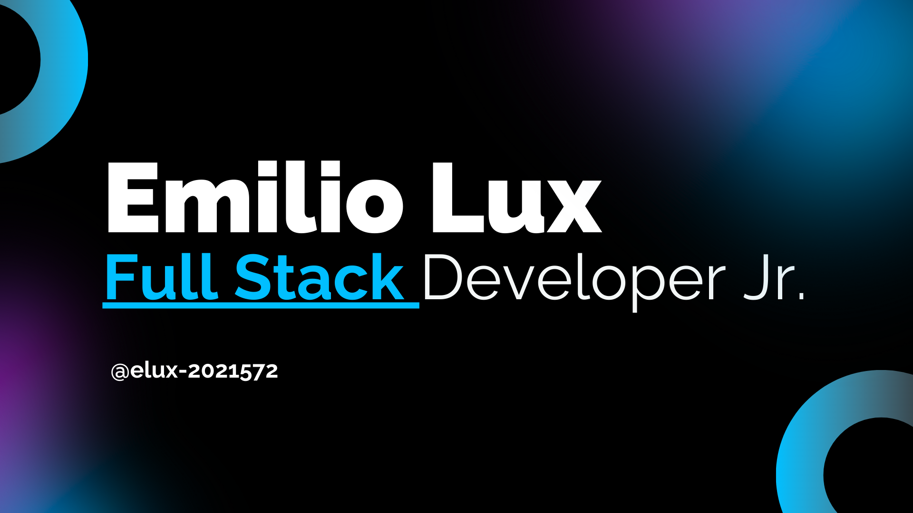

  

## Hey, I'm Emilio! 👋

 

* I am a Full-Stack Developer from Guatemala 🇬🇹
* Visit my [personal website](https://portfolio-elux.netlify.app/) 
* Techstack: `.js`, `.java`, `.jsx`, `.css` 
* Aspiring **Physicist** passionate about applying code to scientific research 🔭

### GitHub Stats

  
📊 Top Languages

   
  
  

### Skills

<table>
  <tr>
    <th>Languages</th>
    <th>Frameworks</th>
    <th>Others</th>
  </tr>
  <tr>
    <td>
       
       
       
      
    </td>
    <td>
       
       
       
      
    </td>
    <td>
       
       
      
    </td>
  </tr>
</table>

### Current Focus

* 🚀 Building web applications with React and modern JavaScript
* 📚 Studying fundamentals of Physics and Mathematics
* 🔬 Exploring scientific applications of programming
* 🌐 Improving my English skills for academic opportunities

### Featured Projects

